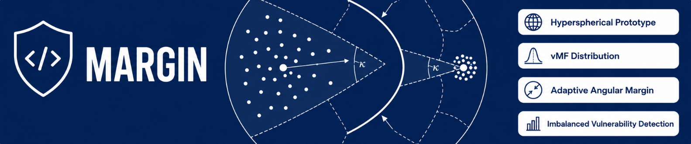
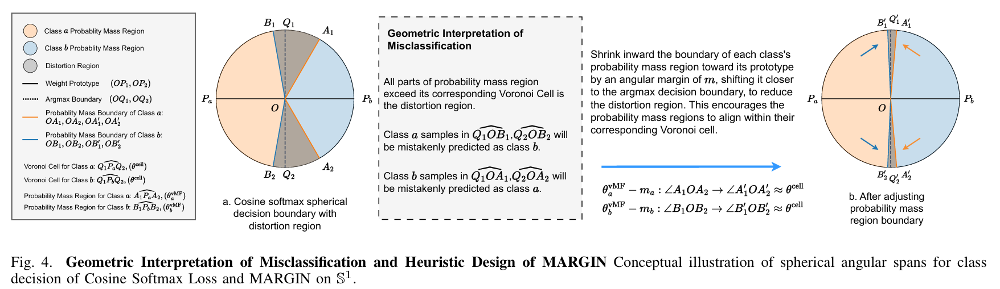

[English](../README.MD) | [中文](./README.zh.MD) | [Français](./README.fr.MD) | [Español](./README.es.MD) | [Русский](./README.ru.MD) | [العربية](./README.ar.MD)

**M**argin-**A**ware **R**egularized **G**eometry for **I**mbalance Vulnerability Detectio**N**

Официальная реализация статьи. Данный репозиторий содержит полные пайплайны обучения и оценки для воспроизведения результатов.

## Аннотация



Обнаружение уязвимостей программного обеспечения имеет решающее значение для обеспечения его безопасности и надёжности. Несмотря на недавние достижения в области глубокого обучения, реальные наборы данных уязвимостей страдают от двух серьёзных проблем: дисбаланса частоты и дисбаланса сложности. Мы переосмысливаем эти проблемы с точки зрения геометрии пространства вложений, отмечая, что такие дисбалансы вызывают геометрические искажения в гиперсферическом пространстве представлений. Для решения этой проблемы мы предлагаем MARGIN — метрический подход, который обучает дискриминативные представления уязвимостей с помощью адаптивного метрического обучения с отступом и гиперсферического моделирования прототипов. MARGIN динамически регулирует геометрическую регуляризацию в соответствии со структурой распределения, оцениваемой концентрацией фон Мизеса-Фишера, выравнивая вероятностную массу распределений вложений с соответствующими ячейками Вороного, тем самым уменьшая геометрические искажения и формируя более стабильные границы решений. Обширные эксперименты на публичных наборах данных уязвимостей показывают, что MARGIN стабильно превосходит сильные базовые модели, достигая заметных улучшений в классификации и обнаружении, особенно на сложных, несбалансированных наборах данных. Дальнейший анализ демонстрирует, что MARGIN формирует более структурированную геометрию вложений, повышая робастность, интерпретируемость и обобщающую способность.

## Требования

- **Память GPU**: ≥ 24 ГБ
- **CUDA**: среда выполнения 12.4 (драйвер ≥ 525 также может работать через обратную совместимость)
- **CPU**: x86-64, ≥ 4 ядер
- **ОЗУ**: ≥ 8 ГБ
- **Дисковое пространство**: ≥ 2 ГБ для набора данных, ≥ 5 ГБ для базовых моделей
- **ОС**: Linux (протестировано на Ubuntu 22.04 / 24.04)

## Установка

### 1. Создание conda-окружения

```bash
conda env create -f environment.yml
conda activate margin
```

### 2. Установка PyTorch

(Сборки CUDA 12.4 — размещены на pytorch.org, не на PyPI)

```bash
pip install torch==2.6.0+cu124          \
            torchvision==0.21.0+cu124   \
            torchaudio==2.6.0+cu124     \
            --index-url https://download.pytorch.org/whl/cu124
```

### 3. Установка HuggingFace CLI

```bash
pip install -U "huggingface_hub"
```

## Загрузка

Набор данных и базовые модели размещены на HuggingFace. Вы можете загрузить их вручную с помощью инструментов CLI.

### Набор данных

```bash
hf download codemetic/MARGIN --repo-type=dataset
```

### Базовые модели

```bash
hf download Salesforce/codet5-base
```

## Обучение

Выполните `python main.py --help`, чтобы увидеть все доступные параметры. Соответствующие гиперпараметры приведены в статье.

Пример команды обучения:

```bash
python  main.py                                           \
        --dataset_subset          bigvul                  \
        --backbone_name           Salesforce/codet5-base  \
        --max_epochs              200                     \
        --max_checkpoints         3                       \
        --early_stopping_patience 30                      \
        --base_scale              20                      \
        --device                  cuda:0                  \
        --seed                    42                      \
        --batch_size              16
```

**ПРИМЕЧАНИЕ:** Результаты обучения и оценки могут незначительно отличаться от оригинальной статьи из-за различий в архитектуре платформы, оборудовании и версиях программного обеспечения.

## Оценка

```bash
python eval.py
```

Интерактивный CLI — используйте `↑` / `↓` для выбора запуска обучения и контрольной точки, затем настройте размер пакета, случайное зерно и устройство перед началом оценки.

## Цитирование

```bibtex
@misc{zhang2026MARGIN,
      title={MARGIN: Margin-Aware Regularized Geometry for Imbalanced Vulnerability Detection}, 
      author={Yuteng Zhang and Huifang Ma and Jiahui Wei and Qingqing Li and Yafei Yang},
      year={2026},
      eprint={2605.10240},
      archivePrefix={arXiv},
      primaryClass={cs.SE},
      url={https://arxiv.org/abs/2605.10240}, 
}
```

## Лицензия

Исходный код и программная реализация в этом репозитории лицензированы под **CC BY 4.0**.

Наборы данных, на которые ссылается или которые использует данный проект, **НЕ** подпадают под действие этой лицензии. Все такие наборы данных остаются интеллектуальной собственностью их соответствующих владельцев и распространяются в соответствии с их собственными лицензиями, условиями использования и условиями доступа. Пользователи несут ответственность за соблюдение применимых лицензионных требований первоначальных поставщиков данных при загрузке, использовании или дальнейшем распространении этих наборов данных.
